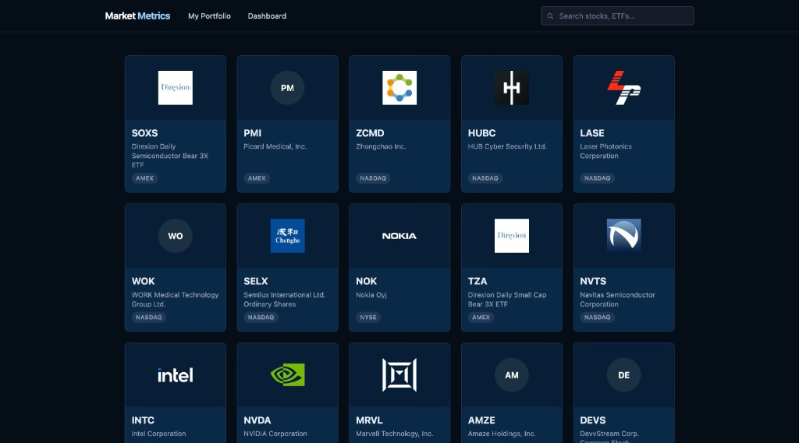
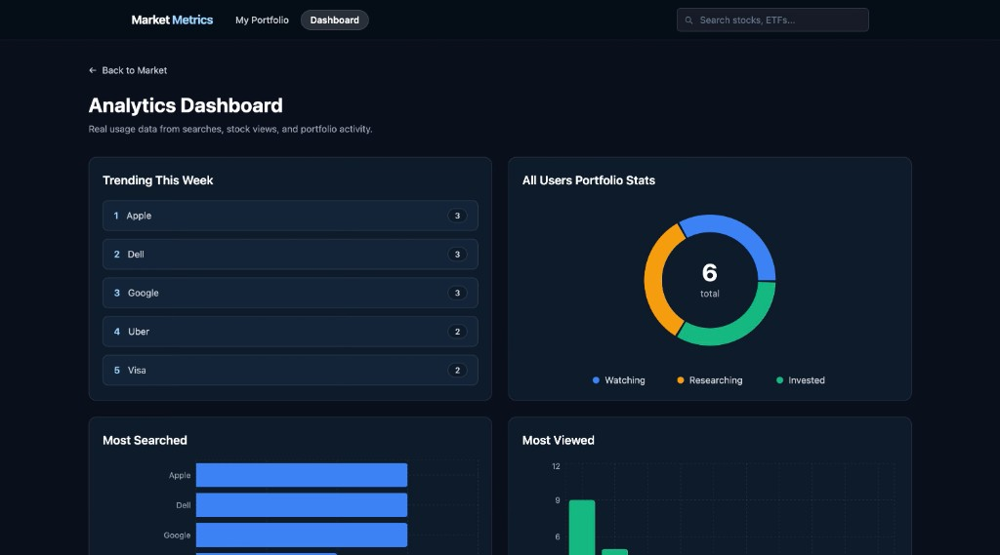
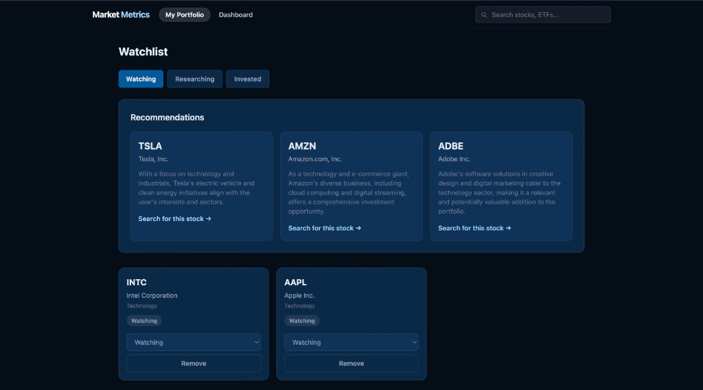

# Market Metrics

MarketMetrics demonstrates the full stack of a data product — from 
anonymous session tracking and server-side telemetry collection, to 
Postgres aggregation functions, to a live Recharts dashboard and 
AI-powered recommendations.

Every chart on the analytics dashboard is powered by real user behavior — 
searches, stock views, and portfolio changes logged in real time to 
demonstrate what a production data pipeline actually looks like end to end.

### Home



### Dashboard



### Watchlist



## Live Demo

**[View live demo →](https://market-metrics-fbclh.vercel.app/)**

## Features

- Portfolio tracker with Watching / Researching / Invested statuses
- Analytics dashboard with real usage data powered by Recharts
- Search and view telemetry logged to Supabase Postgres in real time
- Default view shows 30 most active US stocks by trading volume
- Watchlist by sector breakdown using GICS sector classification
- Anonymous session tracking — no login required
- AI stock recommendations powered by Cohere
- Stock data powered by Financial Modeling Prep (FMP) API
- Keep-alive cron job to maintain Supabase free tier activity

## Tech Stack

Next.js · TypeScript · Supabase (Postgres) · Recharts · shadcn/ui · Tailwind CSS · (FMP) API · Cohere AI API

## Setup

1. Clone the repo

```bash
git clone https://github.com/fbclh/market-metrics.git
cd market-metrics
```

2. Copy `.env.local.example` to `.env.local` and fill in values

3. Run the table schema SQL in `lib/supabase.ts` and `supabase/analytics_functions.sql` in your Supabase SQL editor

4. `npm install`

5. **Run locally**

```bash
npm run dev
```

## Environment Variables

```
FMP_API_KEY=your_fmp_api_key
COHERE_API_KEY=your_cohere_trial_key
NEXT_PUBLIC_SUPABASE_URL=your_supabase_project_url
NEXT_PUBLIC_SUPABASE_ANON_KEY=your_supabase_legacy_jwt_anon_key
```

## Keep-Alive Cron

Supabase free tier pauses after 1 week of inactivity. A Vercel cron
job pings `/api/ping` every 3 days to keep the database active:

```json
{
  "crons": [
    {
      "path": "/api/ping",
      "schedule": "0 12 */3 * *"
    }
  ]
}
```

## Author

Fabio Coelho

## Attribution

Data provided by [FMP](https://financialmodelingprep.com)

## License

This project is licensed under the MIT License. See [LICENSE](LICENSE) for details.